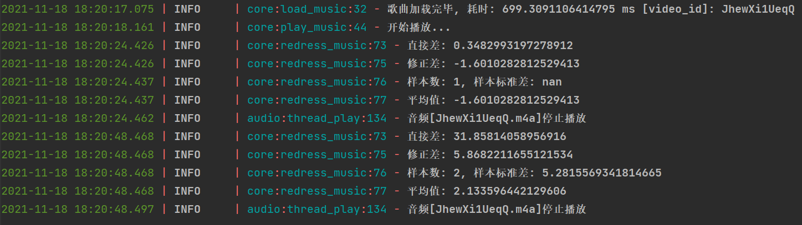

# 我tm要记录下这段该死的魔法

---

rnm !

---

# [魔法原因找到了](#魔法原因找到了-1)

---

~~一开始，基准时间设备不参与矫正，其余设备以基准设备为准矫正时间~~

### 发生情况如下：

~~1. 其余设备在矫正的时候比对理应的时间有大概100ms的时间差，这不是推导出来的，代码看上去应该是0时间差，这是被统计出来的，统计的数据集的样本标准差为0.01~~

~~2. 当矫正设备参与矫正的时候，对比理应时间差为1ms时间差，同样是统计结果，数据集样本标准差为0.01~~

~~3. 全部一起进行矫正的时候，莫名其妙没有差距了，耳朵听出来的感觉也和同时播放无异~~

---

# ~~RNM 魔法！~~

```python
    def upload_Position(self):
        self.sio.emit("Information", {"Identity": self.identity,
                                      "Type": "Position",
                                      "Position": self.audio.get_position(),
                                      "Timestamp": self.get_server_timestamp()})

    temp_array = []

    def redress_music(self, position, timestamp):
        self.temp_array.append(
            self.audio.playerLayer.get_position() - (position + time.time() - (timestamp - self.difference)))
        logger.info(f"直接差: {self.audio.playerLayer.get_position() - position}")
        logger.info(
            f"修正差: {self.audio.playerLayer.get_position() - (position + time.time() - (timestamp - self.difference))}")
        logger.info(f"样本数: {len(self.temp_array)}, 样本标准差: {np.std(self.temp_array, ddof=1)}")
        logger.info(f"平均值: {np.average(self.temp_array)}")
        # 1.1290712900294224

        self.audio.playerLayer.stop()
        self.audio.playerLayer.reset()
        self.audio.playerLayer.set_position_with_benchmark(
            position + (-0.1) + time.time() - (timestamp - self.difference))
        self.audio.playerLayer.play()
        # logger.info(f"矫正完毕, 时间设为:{int(position + ((self.get_server_timestamp() - timestamp) * 1000))}"
        #             f"时间增量: {((self.get_server_timestamp() - timestamp) * 1000)}, "
        #             f"现有差: {int(position + ((self.get_server_timestamp() - timestamp) * 1000)) - self.audio.get_position()}")
        # self.audio.set_position(int(position + (self.get_server_timestamp() - timestamp)))
```
## Device 1 Windows log:



## Device 2 Mac log:


# 魔法原因找到了

## 罪魁祸首:

### <font color=red>错误示范:</font>


```python
    def get_server_timestamp(self):
        return time.time() - self.difference
```


### <font color=green>正确示范:</font>

```python
    def get_server_timestamp(self):
        return time.time() + self.difference
```