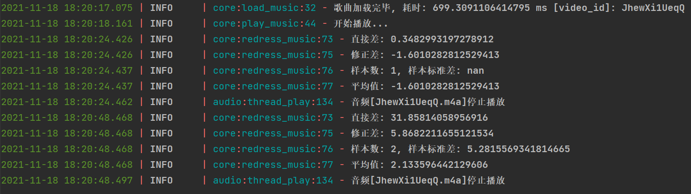

# 我tm要记录下这段该死的魔法

```python
    def upload_Position(self):
        self.sio.emit("Information", {"Identity": self.identity,
                                      "Type": "Position",
                                      "Position": self.audio.get_position(),
                                      "Timestamp": self.get_server_timestamp()})

    temp_array = []

    def redress_music(self, position, timestamp):
        self.temp_array.append(
            self.audio.playerLayer.get_position() - (position + time.time() - (timestamp - self.difference)))
        logger.info(f"直接差: {self.audio.playerLayer.get_position() - position}")
        logger.info(
            f"修正差: {self.audio.playerLayer.get_position() - (position + time.time() - (timestamp - self.difference))}")
        logger.info(f"样本数: {len(self.temp_array)}, 样本标准差: {np.std(self.temp_array, ddof=1)}")
        logger.info(f"平均值: {np.average(self.temp_array)}")
        # 1.1290712900294224

        self.audio.playerLayer.stop()
        self.audio.playerLayer.reset()
        self.audio.playerLayer.set_position_with_benchmark(
            position + (-0.1) + time.time() - (timestamp - self.difference))
        self.audio.playerLayer.play()
        # logger.info(f"矫正完毕, 时间设为:{int(position + ((self.get_server_timestamp() - timestamp) * 1000))}"
        #             f"时间增量: {((self.get_server_timestamp() - timestamp) * 1000)}, "
        #             f"现有差: {int(position + ((self.get_server_timestamp() - timestamp) * 1000)) - self.audio.get_position()}")
        # self.audio.set_position(int(position + (self.get_server_timestamp() - timestamp)))
```

